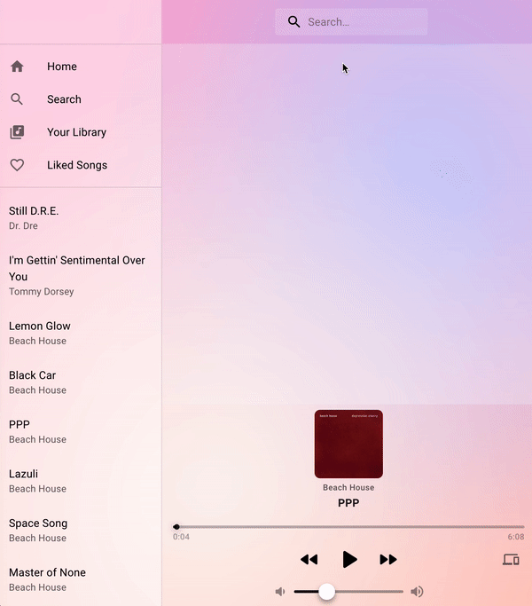

# Spotify web player

## Description

The goal of this project will be to build a web music player with React that uses the Spotify API. The user should be able to login to his spotify account and get his playlists. He should be able to play his songs, search for new music and update/modify his playlists.

## Brand

The brand I will be basing my design off of will be [Apple](https://www.apple.com/).

## Backlog

Below is a list of my must haves and nice to haves for this project.

The API I will be using is :

- [Spotify API](https://developer.spotify.com/documentation/web-api/)

The libraries / frameworks I will be using:

- [Reactjs](https://reactjs.org/)
- [Material UI](https://material-ui.com/)

### Must-Haves

> these are necessary for basic usability

- [ ] User: login to account, view profile
- [ ] Player: start/resume playback, pause, skip to next/previous, set volume, skip to position, add items to queue
- [ ] Playlist: view, create, update or delete playlists
- [ ] Search: search for songs / albums and add them to a playlist

### Nice-to-Haves

> if time, add more features!

- [ ] User: Follow/unfollow playlist, user or artist
- [ ] Player: get available devices, transfer playback
- [ ] Tracks: get detailed info on tracks, save or remove Tracks
- [ ] Tracks: get detailed info on tracks, save or remove Tracks
- [ ] Shows:...
