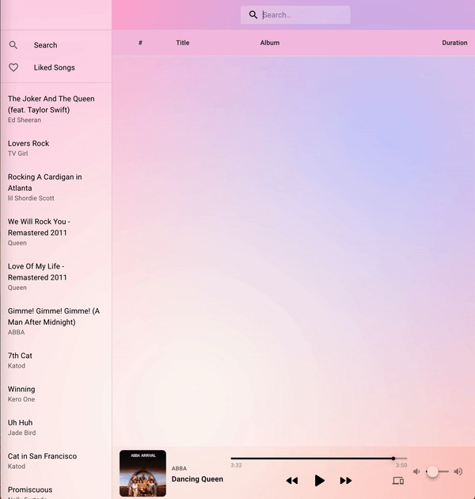

# Spotify web player ♫

## Description

The goal of this project was to build a web music player with React that uses the Spotify Web API. You can search the spotify library for tracks, play them and add them to your favorites.

[DEMO](https://spotify-web-api-backend.herokuapp.com/)

NOTE: To use the playback feature a [spotify premium](https://developer.spotify.com/documentation/web-playback-sdk/) subscription is required.

<p align="center"></p>

## Usage

To run this project you must first setup a backend that will take care of login redirect to the user's Spotify account and fetch the necessary access tokens.

1. Git clone the project and from the root folder (containing the package.json) run `npm install`.
2. Go to the `/server` folder and run `npm install` here as well.
3. You will need to login to [Spotify for Developers](https://developer.spotify.com/dashboard/login) and select `create an app`. In the new app overview you will find a `Client ID` and `Client secret`. Also under `Edit settings` add the following urls in the whitelist: `http://localhost:3000/auth/callback` and `http://localhost:3000/`. A redirect back to the app after user login will fail with an error otherwise.
4. Copy `Client ID` and `Client secret` to the `.example.env` file and rename this file to `.env`.
5. Execute the `npm run start` command to run the server.
6. Go back to the root folder and run `npm run start` to run the React client. This will load the project in your browser from `localhost:3000`. You should see a green `login to spotify` button. Click the button and you should be redirected to a spotify login page. Login to your account and accept the requested permissions. After this you should be redirected back to to the main page of the app.

Some notes:

- The web player will only work if you have a spotify premium account.
- Since `create-react app` comes with its own dev server and we have our own backend for authentication, a proxy is set up in `setupProxy.js` file that routes all `/auth/**` endpoints to our own backend at `localhost:5000`. If you change this port on the backend, make sure you change it in this file as well otherwise authentication will not work.

## Structure

The project uses the following folder structure:

```
.
├── server
│   ├── .env
│   ├── index.js
│   ├── package-lock.json
│   └── package.json
├── src
│   ├── components
│   │   ├── ConnectedDevices.jsx
│   │   ├── Dashboard.jsx
│   │   ├── FavoriteButton.jsx
│   │   ├── Login.jsx
│   │   ├── MusicSearch.jsx
│   │   ├── NavigationWrapper.jsx
│   │   ├── ResourceRow.jsx
│   │   ├── ResourceTable.jsx
│   │   ├── SideBarNavigation.jsx
│   │   ├── TrackListItem.jsx
│   │   ├── WallPaper.jsx
│   │   └── WebPlayback.jsx
│   ├── context
│   │   ├── authContext.js
│   │   └── dashboardContext.js
│   ├── hooks
│   │   ├── useAuth.js
│   │   └── useFetch.js
│   ├── pages
│   │   ├── Home.jsx
│   │   ├── LikedSongs.jsx
│   │   ├── Main.jsx
│   │   ├── Search.jsx
│   │   └── YourLibrary.jsx
│   ├── utils
│   │   └── utils.js
│   ├── App.css
│   ├── App.jsx
│   ├── App.test.js
│   ├── constants.js
│   ├── index.css
│   ├── index.js
│   ├── logo.svg
│   ├── reportWebVitals.js
│   ├── setupProxy.js
│   └── setupTests.js
├── .gitignore
├── package-lock.json
├── package.json
└── README.md

```

## APIs and libraries

The API I used are :

- [Spotify API](https://developer.spotify.com/documentation/web-api/)
- [Web Playback SDK](https://developer.spotify.com/documentation/web-playback-sdk/)

The libraries / frameworks I used:

- [Reactjs](https://reactjs.org/)
- [Material UI](https://material-ui.com/)

## License

&copy; DanijelCvit 2022
